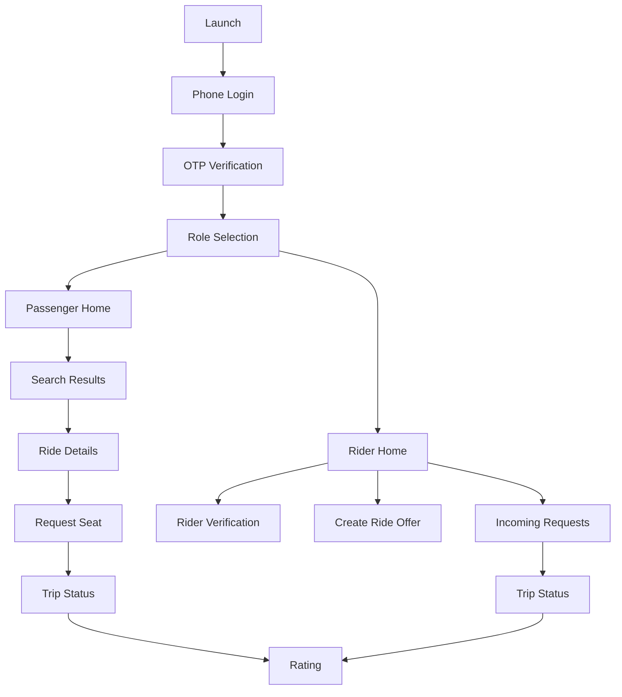

# Wireframes

Low-fidelity wireframes for the Rural Bike Pool Android app and MVP admin console.

These are screen contracts, not visual design. The goal is to make the user journey clear before building Android screens.

## 1. App Information Architecture



## 2. Shared Screens

### 2.1 Launch

Purpose: Establish trust and route users into phone login.

```text
┌──────────────────────────────┐
│ Rural Bike Pool              │
│ Trusted village bike rides   │
│                              │
│ [Continue with phone]        │
│                              │
│ Language: Kannada | English  │
└──────────────────────────────┘
```

Primary actions:

- Continue with phone.
- Choose language.

Notes:

- Kannada should be first-class for Bellary launch.
- Avoid marketing-heavy content. The user needs to book or offer a ride quickly.

### 2.2 Phone Login

```text
┌──────────────────────────────┐
│ Enter mobile number          │
│                              │
│ +91 [__________]             │
│                              │
│ [Send OTP]                   │
│                              │
│ By continuing, you agree...  │
└──────────────────────────────┘
```

Validation:

- 10-digit Indian mobile number.
- Rate-limit OTP resend.

### 2.3 OTP Verification

```text
┌──────────────────────────────┐
│ Verify OTP                   │
│ Sent to +91 9XXXXXXXXX       │
│                              │
│ [ _ ] [ _ ] [ _ ] [ _ ]      │
│                              │
│ [Verify]                     │
│ Resend in 30s                │
└──────────────────────────────┘
```

### 2.4 Role Selection

```text
┌──────────────────────────────┐
│ How do you want to use it?   │
│                              │
│ ┌──────────────────────────┐ │
│ │ I need a ride            │ │
│ │ Search village routes    │ │
│ └──────────────────────────┘ │
│                              │
│ ┌──────────────────────────┐ │
│ │ I own a bike             │ │
│ │ Share rides and earn     │ │
│ └──────────────────────────┘ │
└──────────────────────────────┘
```

Rules:

- User can later switch roles if approved as rider.
- Rider role must go through verification before accepting passengers.

## 3. Passenger Flow

### 3.1 Passenger Home

```text
┌──────────────────────────────┐
│ Good morning, Suresh         │
│                              │
│ Pickup                       │
│ [Current location / Village] │
│                              │
│ Drop                         │
│ [Bellary Bus Stand]          │
│                              │
│ When                         │
│ [Now] [Today] [Tomorrow]     │
│                              │
│ Seats [1]                    │
│                              │
│ [Search rides]               │
│                              │
│ Recent routes                │
│ Village X → Bellary          │
└──────────────────────────────┘
```

Required controls:

- Pickup area input.
- Drop area input.
- Time selector.
- Seat count.
- Search button.

### 3.2 Search Results

```text
┌──────────────────────────────┐
│ Village X → Bellary          │
│ Today, 8:00 AM               │
│                              │
│ ┌──────────────────────────┐ │
│ │ Ramesh                   │ │
│ │ 4.8 ★  KA34 AB 1234      │ │
│ │ Leaves 8:10 AM           │ │
│ │ Rs 80 · 1 seat left      │ │
│ │ [View]                   │ │
│ └──────────────────────────┘ │
│                              │
│ ┌──────────────────────────┐ │
│ │ Mahesh                   │ │
│ │ Leaves 8:30 AM           │ │
│ │ Rs 70 · 1 seat left      │ │
│ │ [View]                   │ │
│ └──────────────────────────┘ │
└──────────────────────────────┘
```

Empty state:

```text
No rides found.
[Create request] [Change time]
```

### 3.3 Ride Details

```text
┌──────────────────────────────┐
│ Ride details                 │
│                              │
│ Rider: Ramesh                │
│ Rating: 4.8 ★                │
│ Bike: KA34 AB 1234           │
│                              │
│ Route                        │
│ Village X → Bellary Bus Stand│
│ Departure: 8:10 AM           │
│ Fare contribution: Rs 80     │
│ Seats left: 1                │
│                              │
│ Safety                       │
│ Verified rider               │
│ Phone visible after accepted │
│                              │
│ [Request seat]               │
└──────────────────────────────┘
```

Privacy:

- Do not show rider phone before request is accepted.

### 3.4 Request Pending

```text
┌──────────────────────────────┐
│ Request sent                 │
│ Waiting for rider response   │
│                              │
│ Ride: Village X → Bellary    │
│ Fare: Rs 80                  │
│                              │
│ [Cancel request]             │
└──────────────────────────────┘
```

### 3.5 Confirmed Trip

```text
┌──────────────────────────────┐
│ Ride confirmed               │
│                              │
│ Ramesh · 4.8 ★               │
│ Bike: KA34 AB 1234           │
│ Phone: 9XXXXXXXXX            │
│                              │
│ Pickup: Village X temple     │
│ Drop: Bellary Bus Stand      │
│ Fare: Rs 80                  │
│                              │
│ [Call rider] [WhatsApp]      │
│ [Share trip] [Report issue]  │
└──────────────────────────────┘
```

### 3.6 Rate Rider

```text
┌──────────────────────────────┐
│ How was your ride?           │
│                              │
│ [★] [★] [★] [★] [★]          │
│                              │
│ Comment                      │
│ [____________________]       │
│                              │
│ [Submit]                     │
└──────────────────────────────┘
```

## 4. Rider Flow

### 4.1 Rider Home

```text
┌──────────────────────────────┐
│ Rider mode                   │
│                              │
│ Verification: Approved       │
│ Availability [On/Off]        │
│                              │
│ [Create planned ride]        │
│                              │
│ Today's rides                │
│ Village X → Bellary 8:10 AM  │
│ 1 passenger · Rs 80          │
│                              │
│ Incoming requests            │
│ 2 pending                    │
└──────────────────────────────┘
```

If not verified:

```text
Verification pending.
[Complete verification]
```

### 4.2 Rider Verification

```text
┌──────────────────────────────┐
│ Rider verification           │
│                              │
│ Profile photo [Upload]       │
│ Bike number [KA34 AB 1234]   │
│ Driving license [Upload]     │
│ RC document [Upload]         │
│ Insurance [Upload]           │
│ Base village [Village X]     │
│                              │
│ [Submit for review]          │
└──────────────────────────────┘
```

Statuses:

- Not submitted.
- Pending review.
- Approved.
- Rejected with reason.

### 4.3 Create Planned Ride

```text
┌──────────────────────────────┐
│ Create ride                  │
│                              │
│ From [Village X]             │
│ To [Bellary Bus Stand]       │
│ Departure [Today 8:10 AM]    │
│ Seats [1]                    │
│ Fare [Rs 80]                 │
│                              │
│ Suggested: Rs 70 - Rs 90     │
│                              │
│ [Publish ride]               │
└──────────────────────────────┘
```

Validation:

- Rider must be approved.
- Fare must be within configured route limits.
- Seat count max 1 for MVP unless policy changes.

### 4.4 Incoming Request

```text
┌──────────────────────────────┐
│ Passenger request            │
│                              │
│ Suresh · 4.6 ★               │
│ Pickup: Village X temple     │
│ Drop: Bellary Bus Stand      │
│ Fare: Rs 80                  │
│                              │
│ [Accept] [Reject]            │
└──────────────────────────────┘
```

Privacy:

- Passenger phone becomes visible after acceptance.

### 4.5 Active Trip

```text
┌──────────────────────────────┐
│ Active trip                  │
│                              │
│ Passenger: Suresh            │
│ Phone: 9XXXXXXXXX            │
│ Pickup: Village X temple     │
│ Drop: Bellary Bus Stand      │
│                              │
│ [Call passenger] [WhatsApp]  │
│                              │
│ [Start trip]                 │
│ [Complete trip]              │
└──────────────────────────────┘
```

Future:

- Add ride PIN before start.

## 5. Admin Console Wireframes

### 5.1 Admin Dashboard

```text
┌────────────────────────────────────────────┐
│ Dashboard                                  │
│                                            │
│ Verified riders      42                    │
│ Pending riders       8                     │
│ Active ride offers   31                    │
│ Trips today          64                    │
│ Complaints open      2                     │
│                                            │
│ [Riders] [Rides] [Trips] [Routes] [Issues] │
└────────────────────────────────────────────┘
```

### 5.2 Rider Verification Review

```text
┌────────────────────────────────────────────┐
│ Rider verification                         │
│                                            │
│ Ramesh · Village X                         │
│ Phone: 9XXXXXXXXX                          │
│ Bike: KA34 AB 1234                         │
│                                            │
│ Profile photo [View]                       │
│ License [View]                             │
│ RC [View]                                  │
│ Insurance [View]                           │
│                                            │
│ [Approve] [Reject] [Request changes]       │
└────────────────────────────────────────────┘
```

### 5.3 Route And Fare Configuration

```text
┌────────────────────────────────────────────┐
│ Routes                                     │
│                                            │
│ Village X → Bellary Bus Stand              │
│ 10 km · Suggested Rs 80 · Max Rs 100       │
│ [Edit]                                     │
│                                            │
│ [Add route]                                │
└────────────────────────────────────────────┘
```

## 6. MVP Navigation

Passenger bottom navigation:

- Home.
- Trips.
- Support.
- Profile.

Rider bottom navigation:

- Home.
- Requests.
- My rides.
- Earnings.
- Profile.

Admin navigation:

- Dashboard.
- Riders.
- Rides.
- Trips.
- Routes.
- Complaints.

## 7. Open UX Decisions

- Should the first screen ask role every time, or remember the last active mode?
- Should passengers be allowed to request rides before profile completion?
- Should rider phone be hidden until both sides confirm?
- Should the first MVP support only 1 passenger per bike?
- Should the route search use map pin selection or village/town area list first?
